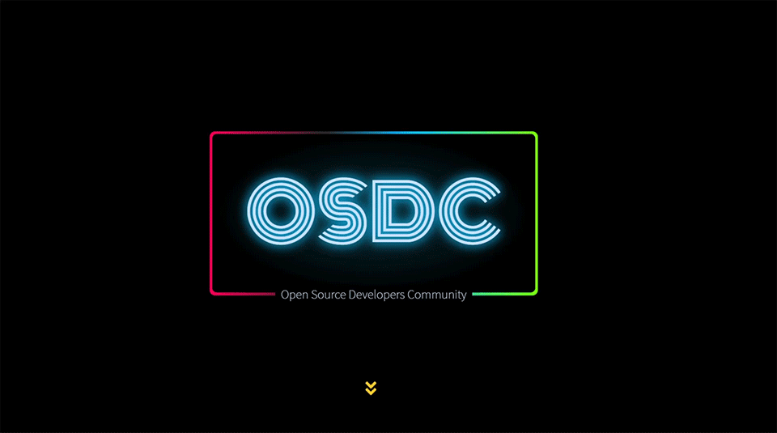

# Linux Open Source Developers Community (LOSDC) Official Website

Repository containing the source code of LOSDC's website built on [GatsbyJS](http://gatsbyjs.org) and [ReactJS](https://reactjs.org) hosted on [Netlify](app.netlify.com). 

Live at [losdc.netlify.com](https://losdc.netlify.com).🚀

## Setup

- Fork and then clone the repository.
- Install [yarn](https://yarnpkg.com/lang/en/docs/install/#mac-stable)
- Run `yarn` to install the necessary packages.
- Install [`gatsby-cli`](https://www.gatsbyjs.org/tutorial/part-zero/#using-the-gatsby-cli).
- Run `gatsby develop` to run the website in development mode on `localhost:8000`.

## Contribute

- Setup the project on your local machine as mentioned above.
- Feel free to open an issue or recommend any changes which you want to see in the website.
- Make sure one issue recommends one logical change.

## Team

-  [@DARK-art108](https://github.com/@DARK-art108) - **Ritesh Yadav**, Maintainer

